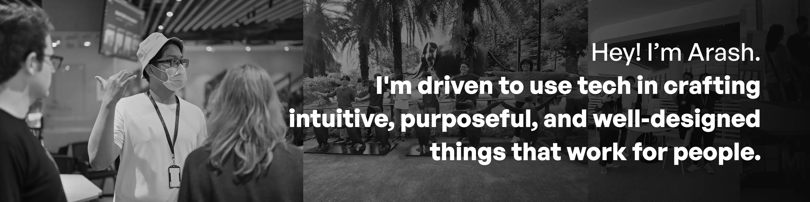

## 👋 Hello world, I'm Arash!

I'm a student + developer driven to craft <dfn title="in a way that feels natural">intuitive</dfn>, <dfn title="in a way that adds meaningful value">purposeful</dfn>, and <dfn title="in a way that is aesthetically pleasing and usable">well-designed</dfn> things with <dfn title="whether software, hardware, or anything in between">tech</dfn> that works for people. I find that to be a rather ambitious statement, and rightfully so; I have a long way to go before getting there, but every step towards it counts!

I find joy in seeing the code I write come alive in one way or another — whether it's seeing it visually or just a command-line interface, most things I do are pretty interesting to me. I mostly deal with front-end web development at the moment, but would also like to have a go at any other parts of development.

---

### 🛠 I'm using...

<table style="width: 100%">
    <tr>
        <th scope="row" style="text-align: right">Python</th>
        <td>8 projects</td>
    </tr>
    <tr>
        <th scope="row" style="text-align: right">JavaScript</th>
        <td>7 projects</td>
    </tr>
    <tr>
        <th scope="row" style="text-align: right">HTML</th>
        <td>3 projects</td>
    </tr>
    <tr>
        <th scope="row" style="text-align: right">TypeScript</th>
        <td>3 projects</td>
    </tr>
    <tr>
        <th scope="row" style="text-align: right">Swift</th>
        <td>2 projects</td>
    </tr>
    <tr>
        <th scope="row" style="text-align: right">C#</th>
        <td>2 projects</td>
    </tr>
    <tr>
        <th scope="row" style="text-align: right">Java</th>
        <td>2 projects</td>
    </tr>
    <tr>
        <th scope="row" style="text-align: right">Go</th>
        <td>1 project</td>
    </tr>
    <tr>
        <th scope="row" style="text-align: right">Astro</th>
        <td>1 project</td>
    </tr>
    <tr>
        <th scope="row" style="text-align: right">Vue</th>
        <td>1 project</td>
    </tr>
    <tr>
        <th scope="row" style="text-align: right">Objective-C</th>
        <td>1 project</td>
    </tr>
    <tr>
        <th scope="row" style="text-align: right">Ruby</th>
        <td>1 project</td>
    </tr>
    <tr>
        <th scope="row" style="text-align: right">Jupyter Notebook</th>
        <td>1 project</td>
    </tr>
</table>

Last updated: 19 May 2025 — <a href="https://github.com/arashnrim/arashnrim/tree/main/update">curious about this?</a>

---

I'm slowly trying to grow out of my comfort zone from time to time, and one way I do so is by reaching out to people I find inspiring. I'll also be glad to hear from you if you'd like to turn the tables and <a href="https://arash.codes/#connect" target="_blank" rel="noreferrer">say hi</a> instead!

We're all learners in one way or another, and I hope your stop here has been helpful. Thank you for stopping by; go on and create awesome things!
