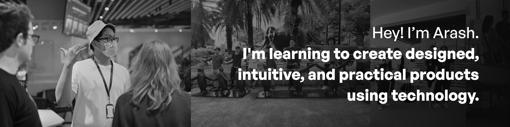

## 👋 Hello world, I'm Arash!

I'm a student developer ardent about creating <dfn title="in a way that is aesthetically pleasing">designed</dfn>, <dfn title="in a way that feels natural to a user">intuitive</dfn>, and <dfn title="in a way that serves some use">practical</dfn> products using technology. I find that to be a rather ambitious statement, and rightfully so; I have a long way to go before getting there, but every step towards it counts!

I find joy in seeing the code I write come alive in one way or another — whether it's seeing it visually or just a command-line interface, most things I do are pretty interesting to me. I mostly deal with front-end web development at the moment, but would also like to have a go at any other parts of development.

---

### 🛠 I'm using...

<table style="width: 100%">
    <tr>
        <th>JavaScript</th>
        <td>8 projects</td>
        <th>Python</th>
        <td>8 projects</td>
        <th>HTML</th>
        <td>4 projects</td>
    </tr>
    <tr>
        <th>Swift</th>
        <td>3 projects</td>
        <th>MDX</th>
        <td>2 projects</td>
        <th>C#</th>
        <td>2 projects</td>
    </tr>
    <tr>
        <th>Jupyter Notebook</th>
        <td>2 projects</td>
        <th>Java</th>
        <td>2 projects</td>
        <th>Go</th>
        <td>1 project</td>
    </tr>
    <tr>
        <th>TypeScript</th>
        <td>1 project</td>
        <th>Shell</th>
        <td>1 project</td>
        <th>Astro</th>
        <td>1 project</td>
    </tr>
    <tr>
        <th>Kotlin</th>
        <td>1 project</td>
</table>

Last updated: 12 January 2025 — <a href="https://github.com/arashnrim/arashnrim/tree/main/update">curious about this?</a>

---

I'm slowly trying to grow out of my comfort zone from time to time, and one way I do so is by reaching out to people I find inspiring. I'll also be glad to hear from you if you'd like to turn the tables and <a href="mailto:hello@arashnrim.me" target="_blank" rel="noreferrer">say hi</a> instead!

We're all learners in one way or another, and I hope your stop here has been helpful. Thank you for stopping by; go on and create awesome things!
