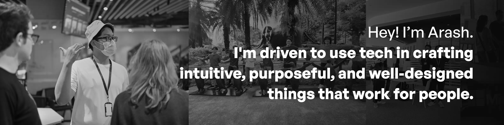

## 👋 Hello world, I'm Arash!

This space is where I explore with code. I find joy in seeing the code I write come to life, whether it's a web project or a command-line interface. I like to think that [learning in public](https://garden.arash.codes/social/learning-in-public) is the best way I learn, so watch this space as I pick up (and occassionally break) things as I go!

---

### 🛠 What I've been using...

<table style="width: 100%">
    <tr>
        <th scope="row" style="text-align: right">Python</th>
        <td>7 projects</td>
    </tr>
    <tr>
        <th scope="row" style="text-align: right">JavaScript</th>
        <td>6 projects</td>
    </tr>
    <tr>
        <th scope="row" style="text-align: right">TypeScript</th>
        <td>4 projects</td>
    </tr>
    <tr>
        <th scope="row" style="text-align: right">Swift</th>
        <td>2 projects</td>
    </tr>
    <tr>
        <th scope="row" style="text-align: right">C#</th>
        <td>2 projects</td>
    </tr>
    <tr>
        <th scope="row" style="text-align: right">Go</th>
        <td>1 project</td>
    </tr>
    <tr>
        <th scope="row" style="text-align: right">Astro</th>
        <td>1 project</td>
    </tr>
    <tr>
        <th scope="row" style="text-align: right">HTML</th>
        <td>1 project</td>
    </tr>
    <tr>
        <th scope="row" style="text-align: right">MDX</th>
        <td>1 project</td>
    </tr>
    <tr>
        <th scope="row" style="text-align: right">Vue</th>
        <td>1 project</td>
    </tr>
    <tr>
        <th scope="row" style="text-align: right">Shell</th>
        <td>1 project</td>
    </tr>
    <tr>
        <th scope="row" style="text-align: right">Objective-C</th>
        <td>1 project</td>
    </tr>
    <tr>
        <th scope="row" style="text-align: right">Ruby</th>
        <td>1 project</td>
    </tr>
</table>

Last updated: 19 March 2026 — <a href="https://github.com/arashnrim/arashnrim/tree/main/update">curious about this?</a>

---

If you're curious to learn more about me, feel free to [have a look at my website](https://arash.codes)! I know it can be daunting to say hi, but [if you do](https://arash.codes/#connect), I'll be sure to say hi. Feel free to also check out [`function()`](https://blog.arash.codes), my blog, and [Δ Delta](https://garden.arash.codes), my digital garden — I'm equally proud of both.

We're all learners in one way or another, and I hope your stop here has been helpful. Thank you for stopping by; go on and create awesome things!
